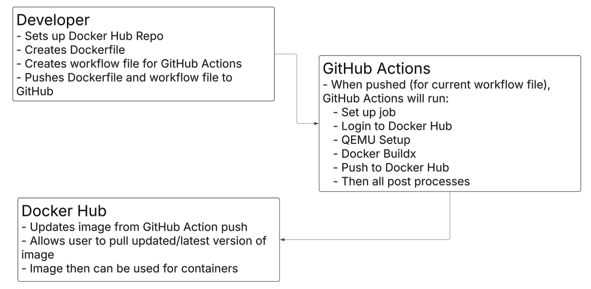

# Overview
- Project 4 teaches the basics of combining GitHub Actions and Docker Hub, along with teaching the basic uses of Docker as a tool at the user's disposal.
# The Beginning of Docker Usage
## How to Set Up Docker
- **Installing Docker**
	- When using MacOS, you are able to go to [Docker Desktop](https://www.docker.com/products/docker-desktop/) and download it.
	- Installing Node.js use: `docker pull node:18-bullseye`
	- As an easy check to see if your Docker is able to run a container:
		- Run the command `docker pull hello-world`
		- Run the command `docker run hello-world` to check that your container can successful run. The output will be: "Hello from Docker!"
- **Configuring a container**
	- As of right now, I am running into issues running my command in one line, so it is broken up into two sections: in terminal and in the container
	- In Terminal Command:
		- `Docker run -it -p 5002:4200 -v ~/ceg3120-cicd-MikeZimmer1299/angular-site/wsu-hw-ng-main/.:/tempApp/ -w /tempApp node:18-bullseye sh`
			- `-it` is the combined flags `-i` and `-t`, which stats an interactive shell in the container
			- `-p` publishes a container's port (or ports) to the host
				- In this case, `5002` is on the host machine, and `4200` is the default port for the Angular app
			- `-v` bind mounts a volume
				- In this case, it binds the file contents inside `~/ceg3120-cicd-MikeZimmer1299/angular-site/wsu-hw-ng-main/.` to `/tempApp` within the container
			- `-w` Changes the working directory inside the container
				- In this case, it changes the directory to the newly created `/tempApp`
			- 
	- In Container Command:
		- `npm install -g @angular/cli && ng serve --host 0.0.0.0`
			- `npm` is the "node package manager"
			- `-g` allows the CLI to install a package globally
			- `@angular/cli` is the CLI that allows you to interact with Angular
			- `ng serve` launches the server, watches files, and rebuilds the app when changes are made
			- `--host 0.0.0.0` sets the default HTTP port
- **Dockerfile Usage**
	- A Dockerfile designates what will be added inside the application container when it is used.
	- Requirements for proper Dockerfile usage
		- `FROM` designates the type of image being used (in this case, it is node:18-bullseye)
		- `WORKDIR` designates the working directory the container will be in
		- `COPY` uses the location of the file chosen on the host, and then the directory where the contests on the host will be copied to
		- `RUN` runs commands listed
			- In this case, `npm install` and `npm install -g @angular/cli` are used
		- `EXPOSE` exposes the port for the host machine
		- `CMD` is used to create and run the angular application
			- `ng serve --host 0.0.0.0` is the command being run
	- To check if the container works properly, enter `http://localhost:XXXX` (the local host's port) in the URL on your browser. If the website populates, it's working
- **Docker Repos**
	- From Docker Hub's website, you are able to go to your "Repositories" and click the `Create a repository` button. Once done, you give the new repo a name, short description if you so choose, and whether it is public or private (only 1 private repo for free accounts).
	- To create a Personal Access Token (PAT), you go to your account settings, click on `Personal access tokens` on the far left side of the screen, click `Generate new token`, and you are given options
		- Access Token Description, choice of expiration date, and whether your key will allow read-only, read and write, or read, write, and delete.
		- Once generated, you will login to your docker account from the CLI
	- To authenticate, enter in the CLI `docker login -u *username*`, then where prompted for a password, enter in the token password Docker Hub gave you after creating your PAT
	- To push the container to the repo, use the command `docker push your/repo/here:latest` to push the latest version of the container to the rep
		- WARNING: Name the container exactly what the repo is called
	- [Link to my Docker Hub](https://hub.docker.com/r/mjzimmer121999/zimmer-ceg3120)
## How to Use Docker
- Useful Tip:
	- To stop a container: `docker stop *NAMES*`, with NAME denoting the name of the container

## Useful Tips I've Learned Along the Way
- When look at the `XXXX:XXXX`, the first is your machine and second is the docker container
	- When creating new containers, the port being used for your machine must be different from other images, such as if 5000 exists, you must make a change to 5001
- For my machine, I am unable to run an overloaded command to set up the container and install the `angular/cli` and `ng serve`. They must be done in two steps currently (as explained above in "Configuring a container")

# Github Actions and Docker Hub
- **GitHub Repo Secrets**
	- For Repo Secrets to work with Docker Hub, you will need a Personal Access Token from Docker Hub. To generate a new PAT, follow the steps above, under `Docker Repos`.
	- Setting GitHub Secrets:
		- At the top bar of GitHub repo, you will click on `Actions`, look at the far left side bar, then go down until you find `Secrets and variables`. Once found, click it and select `Actions`. Under the Actions section, you are able to add repo secrets
		- For rep secrets, click the green button that says `New repository secret`, give it a name (such as "DOCKERHUB_TOKEN"), then enter in necessary info. If it's the token, then take the Docker Hub PAT password, paste it in, and done. If it's the username, then enter the username necessary for correct functioning.
- **CI with GitHub Actions**
	- The workflow currently works on `git push` commands to main branch. When it runs (found under `build_and_push`), it first chooses the type of OS (`ubuntu-latest`) to run the image off of. Once it registers the OS, it will go through the following steps:
		- It will complete `actions/checkout@v3` which prints out 
		- It will login to Docker Hub next, using the `secrets` from GitHub
			- Secrets for username and password are: `DOCKERHUB_USERNAME` and `DOCKERHUB_TOKEN`
		- When successfully logged in, it will build the requested image and push it to Docker Hub
	- To change when these actions are run, you must change the information found under `on:` in the workflow. Currently, the workflow runs every time there is a `push` to `branch main`. You are able to change it from running on `push` to another branch as needed, or even change it to another action, such as `delete`
	- [Here is the link to the workflow](https://github.com/WSU-kduncan/ceg3120-cicd-MikeZimmer1299/blob/main/.github/workflows/project4Workflow.yml)
	- **TIP:** In the `tags` section under `with`, DO NOT unintentionally add the username for the Docker Hub repo twice. **ALSO** don't forget to make sure you don't forget all necessary variables. This has been the root of many an issue
- **Test and Validate**
	- To properly test if the workflow worked, GitHub Actions will state whether it was successful or failed. If it says it failed, it didn't work. If it said it was successful, then you must check your Docker Hub repo. Docker Hub repo will show whether or not there was a successful push. If the push was successful, it will state "Last pushed *period of time* ago."
	- Easiest way to verify the image works in a new container is to create a new container with the updated image. Once done, go to the URL of the angular application. If you gain access to the website, it works.

# Description and Diagram
  - The goal of this project is to teach by application the uses of workflows through GitHub Actions. In doing so, the project takes the Dockerfile from the GitHub repo, builds it, then pushes it to the desired Docker Hub listed in the Dockerfile.
  - Tools used in the project:
    - GitHub Actions
	  - In this project, the Action is to build the Dockerfile image and push it to the user's Docker Hub repo. If any changes were made to the Dockerfile, it will build the updated image and push it to Docker Hub, updating the image that is able to be pulled to make a container.
	  - Dockerfile
	    - The Dockerfile is used to create an image for a new container. The Dockerfile sets up an Angular website, using Node.js, version `18-bullseye`. It changes the container's working directly, copies the application data to the desired folder in the container, then installs `npm` and `@angular/cli`. The Dockerfile exposes the desired port, then runs the command `ng serve --host 0.0.0.0` to allow access to the website through the web application.
	  - Docker Hub
	    - Docker Hub is where the Dockerfile image is able to be downloaded from to create or update containers.
  - **Diagram**
    - 
## Resources Found and Used
- [Help Understanding "sh -c" in Docker commands](https://docs.docker.com/reference/cli/docker/container/exec/)
	- Explains `-w`/ `--workdir`
- [Running Containers Info](https://docs.docker.com/engine/containers/run/)
	- It has many good explanations for the different flags 
- [Bind Mounts](https://docs.docker.com/engine/storage/bind-mounts/)
	- Explains the ways to bind mounts. In my case, it gave explanation to `-v` for volume options
- [Writing a Dockerfile](https://www.digitalocean.com/community/tutorials/how-to-build-a-node-js-application-with-docker)
	- Explained the necessary parameters required inside a Dockerfile for it to properly function
- [Jon Wasky](https://github.com/Wamski)
	- Helped realize a future issue as a Mac user, requiring the use of `docker/setup-qemu-action@v3` and `platforms: linux/amd64, linux/arm64` to allow use on both amd and arm based systems.
- [Building Multi-Platform Docker Images for ARM64](https://www.blacksmith.sh/blog/building-multi-platform-docker-images-for-arm64-in-github-actions)
	- This article gives useful information about GitHub Actions and using it to work with ARM64 Docker images, working in tandem with Jon Wasky's advice in what to look for. Explains the use of QEMU and `platforms`